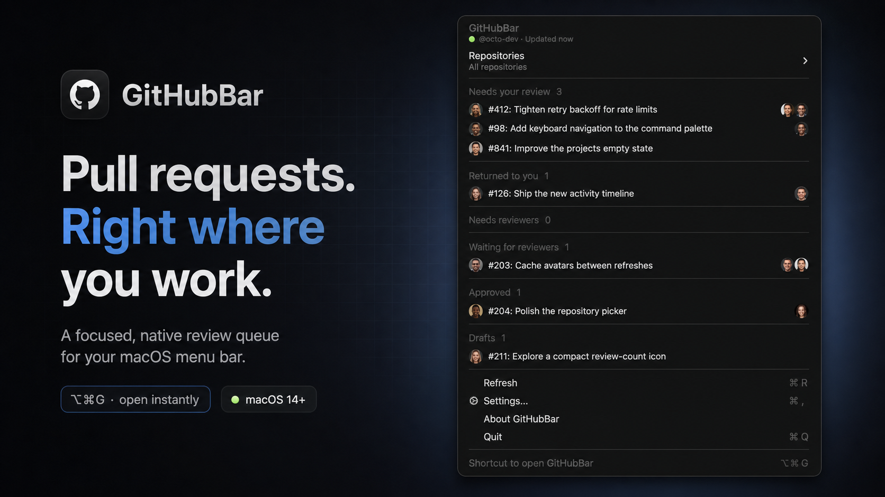

<div align="center">

# GitHubBar

### Your pull requests, one shortcut away.

[](https://github.com/FranciscoMoretti/githubbar/releases)
[](https://github.com/FranciscoMoretti/githubbar/releases)
[](https://www.swift.org/)
[](https://cli.github.com/)



GitHubBar is a native macOS menu-bar app that keeps the pull requests needing your attention close at hand. See your review queue, follow your own work, and open the right PR without repeatedly loading GitHub.

[Download the latest validation build](https://github.com/FranciscoMoretti/githubbar/releases) · [Build from source](#build-from-source) · [Report an issue](https://github.com/FranciscoMoretti/githubbar/issues)

</div>

> [!NOTE]
> GitHubBar is in active validation. Current builds are ad-hoc signed and not notarized; verify the provided SHA-256 checksum before installing.

## The review loop, without the tab loop

| See what needs you | Know what is moving | Stay in flow |
| --- | --- | --- |
| The menu-bar icon carries your review count, while **Needs your review** puts every requested review in one place. | Your PRs are grouped into **Returned to you**, **Needs reviewers**, **Waiting for reviewers**, **Approved**, and **Drafts**. | Press <kbd>⌥</kbd><kbd>⌘</kbd><kbd>G</kbd> from anywhere, filter by repository, then open a PR directly on GitHub. |

GitHubBar is deliberately small and native: no Dock icon, no embedded web app, and no extra account to manage. It uses your existing [GitHub CLI](https://cli.github.com/) connection and keeps a local snapshot so the menu is useful immediately after launch.

## Highlights

- **A real macOS menu.** Fast keyboard navigation, familiar shortcuts, native highlighting, and VoiceOver labels.
- **Review state at a glance.** The status icon shows how many PRs are waiting for your review.
- **Your workload, sorted.** Authored PRs are separated by the next action instead of flattened into one list.
- **Repository scope.** Watch everything you can access or focus the menu on one repository.
- **People in context.** Author and reviewer avatars make a busy queue easier to scan.
- **Fresh without being noisy.** Choose a refresh cadence, refresh manually with <kbd>⌘</kbd><kbd>R</kbd>, and keep the last good snapshot through transient failures.
- **Made to disappear.** Launch at login, open it with <kbd>⌥</kbd><kbd>⌘</kbd><kbd>G</kbd>, and get back to work.

## Install a validation build

### Requirements

- macOS 14 Sonoma or newer
- [GitHub CLI](https://cli.github.com/) installed and authenticated with `gh auth login`

Download the ZIP and checksum from the [latest release](https://github.com/FranciscoMoretti/githubbar/releases). Validation builds are universal (`arm64` and `x86_64`) but are not notarized, so macOS may require you to explicitly allow the first launch.

<details>
<summary><strong>Install and verify from Terminal</strong></summary>

```sh
release="$(gh release list \
  --repo FranciscoMoretti/githubbar \
  --limit 1 \
  --json tagName \
  --jq '.[0].tagName')"
download_dir="$(mktemp -d)"
mkdir -p "$HOME/Applications"
cd "$download_dir"

gh release download "$release" \
  --repo FranciscoMoretti/githubbar \
  --pattern '*.zip' \
  --pattern '*.zip.sha256'

shasum -a 256 --check ./*.zip.sha256
ditto -x -k ./*.zip .
rm -rf "$HOME/Applications/GitHubBar.app"
mv GitHubBar.app "$HOME/Applications/GitHubBar.app"
xattr -dr com.apple.quarantine "$HOME/Applications/GitHubBar.app"
open "$HOME/Applications/GitHubBar.app"
```

These commands replace an existing copy in `~/Applications`. Removing the quarantine attribute opts this verified download out of Gatekeeper assessment; only do this when the checksum succeeds and the files came from this repository.

</details>

On first launch, GitHubBar appears in the menu bar and connects through your authenticated GitHub CLI account.

## Privacy and local data

- GitHubBar asks GitHub CLI for a temporary token, uses it in process memory, and never stores it.
- Your selected account, repository scope, refresh cadence, and app preferences stay on this Mac.
- The active pull-request snapshot is stored in Application Support with owner-only permissions.
- Diagnostics record refresh timing, counts, completeness, and failure categories—not tokens, headers, repository names, PR titles, or usernames.

## Build from source

You will need macOS 14+, Xcode with the macOS 14 SDK, [XcodeGen](https://github.com/yonaskolb/XcodeGen), and an authenticated GitHub CLI.

```sh
brew install xcodegen gh
scripts/generate-project.sh
open GitHubBar.xcodeproj
```

Choose the `GitHubBar` scheme and run it. GitHubBar is an accessory app, so it appears in the menu bar rather than the Dock.

Run the complete local check suite with:

```sh
scripts/check.sh
```

Package a universal, ad-hoc-signed validation artifact with:

```sh
GITHUBBAR_VERSION=0.1.0 scripts/package-validation.sh
```

Release details live in the [validation guide](docs/releases/validation-release.md). The fail-closed Developer ID, notarization, and Sparkle pipeline is documented in the [stable release runbook](docs/releases/stable-release-runbook.md).

## Contributing

Bug reports and focused pull requests are welcome. Start with [GitHub Issues](https://github.com/FranciscoMoretti/githubbar/issues), and include your macOS version, GitHubBar build, and the smallest reproducible description you can.

---

<div align="center">
<sub>Built for developers who would rather review the PR than find the PR.</sub>
</div>
