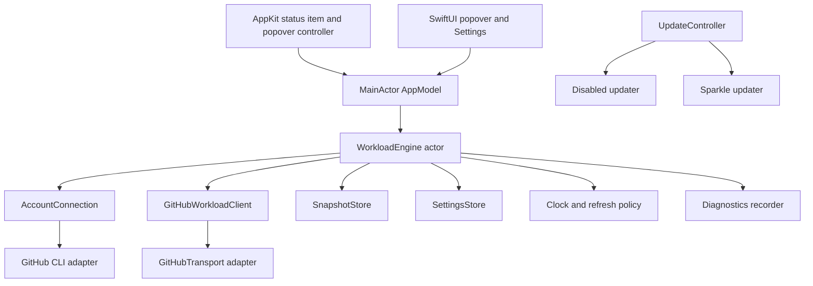

# GitHubBar MVP architecture

Status: implementation-ready

This specification fixes the module shape, seams, state ownership, persistence, packaging, and acceptance boundaries for the native macOS MVP. Product behavior and vocabulary remain defined by `CONTEXT.md` and the linked Wayfinder decisions.

## System shape



`WorkloadEngine` is the primary deep module. Deleting it would redistribute connection, refresh, cache, scheduling, publication, and Repository-scope complexity across the app; its depth is therefore intentional.

## Build structure

Use Swift 6 with strict concurrency and a macOS 14 deployment target.

```text
GitHubBar.xcodeproj
GitHubBar/
  App/
  StatusItem/
  Popover/
  Settings/
  Updates/
Packages/GitHubBarCore/
  Package.swift
  Sources/GitHubBarCore/
    Domain/
    Workload/
    Account/
    GitHub/
    Persistence/
    Preferences/
    Diagnostics/
  Tests/GitHubBarCoreTests/
scripts/
```

- `GitHubBar` is the only app target. It owns AppKit, SwiftUI, ServiceManagement, and Sparkle integration.
- `GitHubBarCore` is one local Swift package library target organized into logical modules by folder. It imports Foundation and OSLog, but not AppKit, SwiftUI, or Sparkle.
- Do not create one build target per logical module. Add a target only when a real compilation, platform, or dependency boundary appears.
- Use a small construction root in the app delegate to create adapters and inject them. Do not add a dependency-injection framework.

## External interface of WorkloadEngine

The UI-facing interface has two operations:

```swift
func states() -> AsyncStream<AppPresentationState>
func send(_ command: WorkloadCommand) async
```

`WorkloadCommand` covers launch, manual refresh, sustained popover open, selected-account confirmation/recheck, Repository-scope change, and refresh-setting change. `AppPresentationState` is immutable and contains only what the UI and status item need:

- Account connection and Access coverage presentation;
- Refresh health, last-updated time, and whether existing data is refreshing;
- Repository scope and available repository choices;
- Waiting for my review and My PRs projections;
- Review count and exact accessibility count;
- Empty and recovery-state presentation data.

The engine actor owns all mutable workload state, in-flight tasks, generation numbers, refresh scheduling, and publication. Account changes cancel pending work and prevent results from the previous generation from publishing.

`AppModel` is a `@MainActor @Observable` adapter. It consumes the state stream, exposes the latest immutable state, and forwards user commands. It contains no network, process, scheduling, projection, or persistence logic.

## Deep infrastructure seams

### AccountConnection

One inspection operation accepts the selected login and returns a typed account-connection result. The GitHub CLI adapter hides executable discovery, authenticated-account enumeration, temporary token retrieval, `viewer.login` verification, scope inspection, and Access coverage diagnostics.

The production adapter invokes GitHub CLI through an injected command runner; tests use a fake runner. Tokens exist in process memory only and must never be written to GitHubBar storage or logs. GitHubBar never calls `gh auth switch`.

### GitHubWorkloadClient

One reconciliation operation accepts the resolved account, Repository scope, and previous Snapshot, and returns a typed complete, partial, or failed result. The production GraphQL implementation hides:

- authored, direct-request, and team-request discovery;
- deduplication and search sharding;
- pagination and bounded hydration concurrency;
- review-roster construction and pagination;
- GraphQL cost inspection, retry, rate-limit, and partial-error handling;
- repository catalog lookup for the searchable Repository-scope control.

Use `URLSession` and Codable. Do not add a GraphQL client library. Do not request checks, mergeability, comments, bodies, diffs, or derived workflow data.

### SnapshotStore

The interface loads, atomically saves, and clears a versioned account-bound Snapshot. The production adapter stores JSON in Application Support with owner-only permissions; tests use an in-memory adapter. A corrupt, incompatible, or differently owned Snapshot is rejected rather than partially trusted.

### SettingsStore

The interface loads and saves typed preferences. The production adapter uses UserDefaults for selected login, Pinned repositories, refresh cadence, launch-at-login choice, and update preferences. The active Repository scope is session-only and defaults to All at launch. No database or Keychain is required for the MVP.

### Clock and refresh policy

The engine uses an injected Swift `Clock` and pure cadence policy. Tests use a controllable clock. All launch, timer, sustained-popover-open, and manual triggers join one single-flight reconciliation. There is no helper process, daemon, catch-up burst, or background refresh after the app process exits.

### UpdateController

The app owns a small updater interface with two real adapters selected by build configuration:

- validation builds use a disabled updater and expose no Sparkle behavior;
- signed stable builds use Sparkle and expose background checks plus Check for Updates.

Sparkle is not visible to `GitHubBarCore`.

## Native app shell

- Use an AppKit app delegate and `NSStatusItem.squareLength`; the app has no Dock icon or dashboard window.
- `StatusItemController` owns the status button, an 18×18 point template-image renderer, `NSPopover` anchoring, open/close behavior, and accessibility title.
- The icon shows no count at zero, exact values from 1–99 in an open lower-right carve, and visually caps larger values at `99`; the accessibility title contains the exact Review count.
- SwiftUI owns the accepted Variant D popover and the Settings scene.
- Clicking a pull-request row opens GitHub through `NSWorkspace`. Copy link may be offered through a context menu. There is no row expansion, checkout, inline mutation, or GitHub write action.
- Launch at login uses `SMAppService` and remains opt-in.

## State, persistence, and failure rules

- On launch, load and publish the selected account's Snapshot before starting network work.
- A complete reconciliation authoritatively replaces membership.
- A partial reconciliation merges successful updates without absence-based deletion.
- A total failure retains the last useful Snapshot and Review count.
- Missing GitHub CLI, missing authentication, or a removed selected account produces Account connection required and does not show another account's Snapshot.
- Repository scope switches between All and the device-local Pinned repositories and controls both lists and Review count. It is session-only and defaults to All at launch; Pin membership persists locally. Pin changes and scope changes re-project the retained Account workload without Reconciliation.
- The MVP contains no notification engine, snooze, mute, unread state, notification history, or transition-detection subsystem.

Store no pull-request history beyond the active Snapshot. Switching or removing accounts clears or isolates private cached metadata by GitHub host and monitored-account ID.

## Dependencies and diagnostics

Apple frameworks plus Sparkle are the only runtime dependencies. Use native URL loading and caching for reviewer avatars, with initials or team marks as fallback.

Record structured local OSLog diagnostics for refresh reason, duration, GraphQL cost, counts, batch sizes, completeness, and failure category. Do not record repository names, pull-request titles, usernames, access tokens, GraphQL bodies, or response bodies. The MVP has no analytics or telemetry upload.

## Settings and presentation acceptance

Settings contains Account connection, a searchable Pinned-repository table, refresh cadence, launch at login, updates, and About. The menu exposes compact All and Pinned scope tabs. It contains no notification, snooze, mute, workflow, or history settings.

Both PR section headings remain present when empty and show a quiet section-level message. Account connection and first-load failures remain global states rather than empty-list messages.

Use native keyboard focus and activation, VoiceOver labels for PR state, repository, title, and reviewers, the exact uncapped Review count, reduced-motion behavior, and no meaning conveyed by color alone.

## Verification

The production seams have corresponding fakes for GitHub transport, GitHub CLI commands, Snapshot storage, settings, clock, and updater. Exercise behavior through the same interfaces used by the app.

Required sanitized fixtures and scenarios:

- 500 active pull requests and 100 newly relevant pull requests;
- direct/team request deduplication and roster pagination beyond 100 entries;
- complete, partial, failed, rate-limited, and corrupt-response reconciliation;
- account switching and Repository-scope changes during an in-flight refresh;
- missing CLI, unauthenticated CLI, incomplete access, corrupt Snapshot, and first load;
- validation updater disabled and stable Sparkle adapter enabled;
- fresh, refreshing, cached failure, incomplete access, connection-required, and empty-list UI states.

Performance acceptance:

- publish a cached presentation within 250 ms of launch;
- render an existing popover state without waiting for network work;
- complete a normal 500-PR reconciliation within 10 seconds;
- perform no synchronous process, filesystem, or network work on the main actor.

## Future Issues support

Do not add `WorkItem`, generic list-membership protocols, or issue-shaped fields to pull-request domain types. A later Issues feature may reuse AccountConnection, GitHubTransport, scheduling primitives, diagnostics, and persistence conventions while adding its own Issue workload, Snapshot, and presentation projection. Introduce a shared domain interface only after two real workloads demonstrate it.

## Explicitly absent from the MVP architecture

- Notification engine, local triage engine, history store, analytics client, or background helper;
- workflow classification, merge readiness, checks, comments, conflicts, or approval-state projection;
- database, OAuth backend, GitHub App installation model, or duplicated credential store;
- generic Issues abstraction, multiple monitored accounts, or GitHub Enterprise Server;
- Mac App Store or Homebrew packaging.
